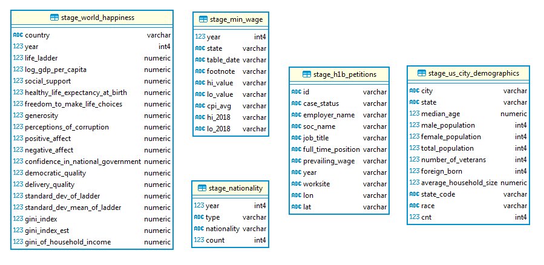
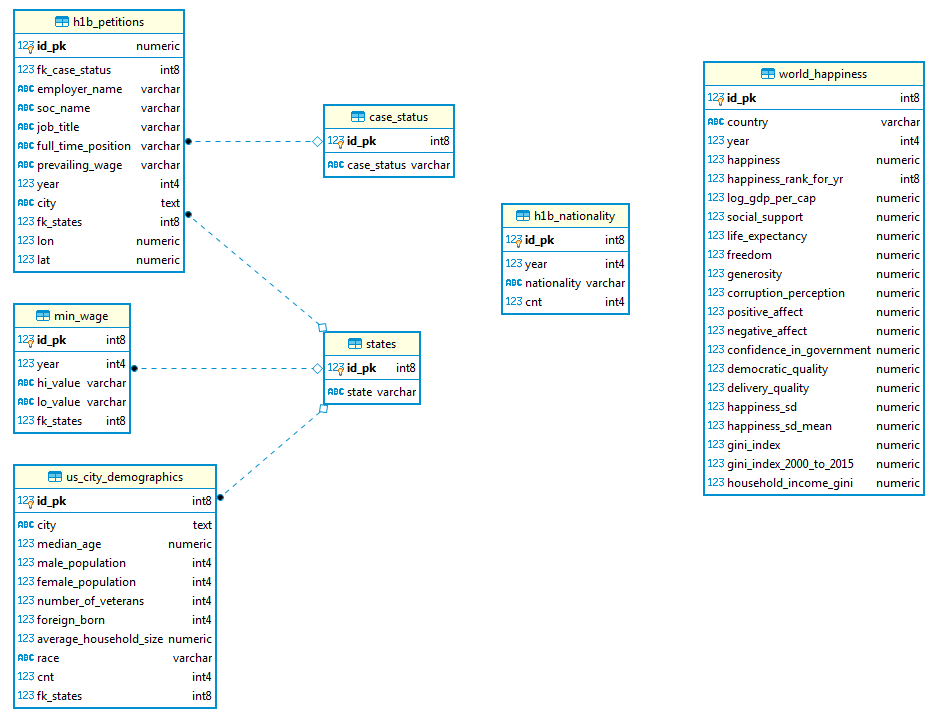
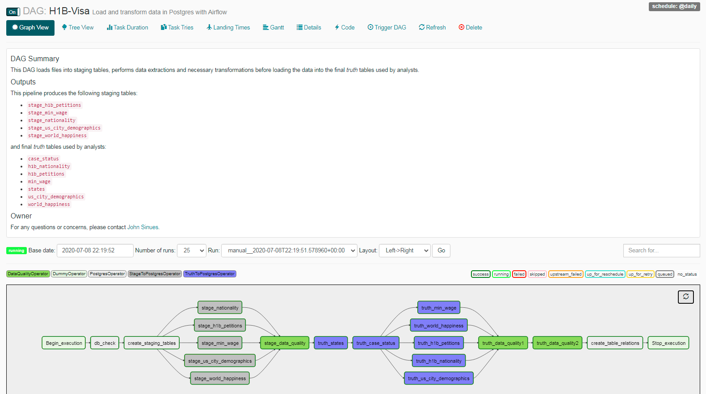

# Introduction
On June 22, 2020 President Donald Trump signed an executive order limiting the number of immigrants entering the United States.  Effective June 24 to at least the end of 2020, the US will stop the issuance of a variety of visas for foreign workers.  

Of the many types, the coveted H1-B visas are used by tech companies to fill in voids in talent.  Our most influential and profitable companies -- Google, Amazon, Apple, and Facebook are [deeply disappointed by this proclamation](https://www.ibtimes.com/trump-immigration-crackdown-tech-giants-google-apple-amazon-others-slam-executive-2999121).  In 2019, Google and Amazon were each granted roughly [9,000 H1-B visa applications](https://www.msn.com/en-us/money/markets/amazon-google-twitter-and-other-tech-companies-are-speaking-out-against-trumps-freeze-on-immigrant-work-visas/ar-BB15QWe9).  

## Problem
A small group wants to investigate the impact of this action. They would like to answer questions such as how many people apply for H1-B visas and what type of positions are being filled. With the effects of COVID-19 and the reduction of immigrants, can US citizens fill the talent void?  Are certain countries targeted for H1-B visas?  

The goal is to manage disparate data across various systems and provide a [Single Source of Truth](https://www.forbes.com/sites/brentdykes/2018/01/10/single-version-of-truth-why-your-company-must-speak-the-same-data-language/#1a6047b81ab3) for this H1-B visa information.

The underlying database structure will allow users to perform ad-hoc queries to explore the data.

## 1 - Scope the Project and Gather Data

### Datasets
* [H-1B visa Petitions for the period 2011 to 2016](https://www.kaggle.com/nsharan/h-1b-visa)
* 3,002,458 records

| Column         | Description |
| :------------- | :-------------------------------------------- | 
| Unnamed: 0 |ID of the row|
| CASE_STATUS |Status associated with the last significant event or decision. Valid values include “Certified,” “Certified-Withdrawn,” Denied,” and “Withdrawn”.|
| EMPLOYER_NAME |Name of employer submitting the H1-B application.|
| SOC_NAME |The occupation code for the employment.|
| JOB_TITLE |Title of the job using which we can filter specific job positions for e.g., Data Scientist, Data Engineer etc.|
| FULL_TIME_POSITION |Whether the application is for a full-time position of for a part-time position.|
| PREVAILING_WAGE |The prevailing wage for a job position is defined as the average wage paid to similarly employed workers in the requested occupation in the area of intended employment. The prevailing wage is based on the employer’s minimum requirements for the position.| 
| YEAR |The application year.|
| WORKSITE |The foreign worker’s intended area of employment. We will explore the relationship between prevailing wage for Data Scientist position across different locations.|
| lon |Longitude of the employer worksite.|
| lat |Latitude of the employer worksite.|

---

* [Nonimmigrant Visa Issuances by Visa Class and by Nationality](https://public.opendatasoft.com/explore/dataset/fys97-16_nivdetailtable/table/?sort=-year)
* 2,070 records

| Column         | Description |
| :------------- | :-------------------------------------------- | 
| year | Year issued |
| Type | Visa type (H1-B) |
| Nationality | national or ethnic character of group |
| count | number of applicants |

---

* [US Minimum Wage By State](https://www.kaggle.com/lislejoem/us-minimum-wage-by-state-from-1968-to-2017)
* 2,750 records

| Column         | Description |
| :------------- | :-------------------------------------------- | 
| Year | year of survey |
| State | state/territory |
| Table_Data | scraped, unclean data from the US Department of Labor |
| Footnote | footnote associated with Table_Data, provided by the US Department of Labor |
| High.Value | As there were some values in Table_Data that had multiple values (usually associated with footnotes), this is the higher of the two values in the table. It could be useful for viewing the proposed minimum wage, because in most cases, the higher value meant that all persons protected under minimum wage laws eventually had minimum wage set at that value. |
| Low.Value | This is the same as High.Value, but has the lower of the two values. This could be useful for viewing the effective minimum wage at the year of setting the minimum wage, as peoples protected under such minimum wage laws made that value during that year (although, in most cases, they had a higher minimum wage after that year). |
| CPI.Average | This is the average Consumer Price Index associated with that year. It was used to calculate 2018-equivalent values. |
| High.2018 | This is the 2018-equivalent dollars for High.Value. |
| Low.2018 | This is the 2018-equivalent dollars for Low.Value. |

---

* [World Happiness Data](https://www.kaggle.com/arielyeung/world-happiness-data)
* 1,562 records

| Column         | Description |
| :------------- | :-------------------------------------------- | 
| country | country|
| year | year of survey |
| Life Ladder | happiness score or subjective well-being |
| Log GDP per capita |  statistics of GDP per capita in purchasing power parity (log scale) |
| Social support |  The national average of the binary responses (either 0 or 1) to the GWP question *If you were in trouble, do you have relatives or friends you can count on to help you whenever you need them, or not?* |
| Healthy life expectancy at birth |  Healthy life expectancies at birth are based on the data extracted from the World Health Organization’s (WHO) Global Health Observatory data repository.|
| Freedom to make life choices | The national average of responses to the GWP question *Are you satisfied or dissatisfied with your freedom to choose what you do with your life?* |
| Generosity | The residual of regressing national average of response to the GWP question *Have you donated money to a charity in the past month?* on GDP per capita.|
| Perceptions of corruption | The national average of the survey responses to two questions in the GWP: *Is corruption widespread throughout the government or not* and *Is corruption widespread within businesses or not?* The overall perception is just the average of the two 0-or-1 responses. In case the perception of government corruption is missing, we use the perception of business corruption as the overall perception. The corruption perception at the national level is just the average response of the overall perception at the individual level.|
| Positive affect | Defined as the average of three positive affect measures in GWP: happiness, laugh and enjoyment in the Gallup World Poll waves 3-7. These measures are the responses to the following three questions, respectively: *Did you experience the following feelings during A LOT OF THE DAY yesterday? How about Happiness?*, *Did you smile or laugh a lot yesterday?*, and *Did you experience the following feelings during A LOT OF THE DAY yesterday? How about Enjoyment?* |
| Negative affect |  Defined as the average of three negative affect measures in GWP. They are worry, sadness and anger, respectively the responses to *Did you experience the following feelings during A LOT OF THE DAY yesterday? How about Worry?*, *Did you experience the following feelings during A LOT OF THE DAY yesterday? How about Sadness?*, and *Did you experience the following feelings during A LOT OF THE DAY yesterday? How about Anger?*|
| Confidence in national government | unsure how calculated |
| Democratic Quality | unsure how calculated |
| Delivery Quality | unsure how calculated |
| Standard deviation of ladder by country-year | standard deviation of country's happiness score  |
| Standard deviation/Mean of ladder by country-year | standard deviation of country's happiness score |
| GINI index (World Bank estimate) | GINI index |
| average 2000-15 | average GINI index from 2000-15 |
| gini of household income reported in Gallup, by wp5-year | Household Income International Dollars |

---

* [US City demographics, data comes from the US Census Bureau's 2015 American Community Survey](https://public.opendatasoft.com/explore/dataset/us-cities-demographics/export/)
* 2,891 records

| Column         | Description |
| :------------- | :-------------------------------------------- | 
| City | US city |
| State | US state |
| Median Age | median age |
| Male Population | number of males | 
| Female Population | number of females |
| Total Population | total population |
| Number of Veterans | number of veterans |
| Foreign-born | number of foreign born |
| Average Household Size | average household size |
| State Code | state abbreviation | 
| Race | race, ethnic group | 
| Count | race count |

---

## 2 - Explore and Assess the Data

The data files are loaded into staging tables for procesing.  The table structure follows.

 

## 3 - Define the Data Model

Since the goal is data exploration, the data is normalized for query execution.  Each table is given a primary key and data extracted as needed.  For example, in the `stage_h1b_petitions` table, the `worksite` column was separated into columns `city` and `fk_states` in `h1b_petitions`.

## 4 - Run ETL to Model the Data

The workflow:

1. `db_check`:  Verify database connectivity.

2. `create_staging_tables`:  Build staging tables to receive import files.

3.  `stage_nationality`, `stage_h1b_petitions`, `stage_min_wage`,`stage_us_city_demographics`, `stage_world_happiness`:  If configured properly, load staging tables simultaneously from files.

4.  `stage_data_quality`:  Ensure staging tables loaded properly by verifying tables counts match number of lines in file.

5.  `truth_states`:  Create `states`
 table.

6.  `truth_case_status`:  Create `case_status` table.

7.  `truth_min_wage`, `truth_us_city_demographics`, `truth_world_happiness`,
     `truth_h1b_nationality`, `truth_h1b_petitions`:  If configured properly, load remaining tables simultaneously from staging tables.

8.  `truth_data_quality1`:  Ensure staging table record counts match destination table counts.

9.  `truth_data_quality2`:  Additional data quality checks that compare counts from two SQL statements.

10.  `create_table_relations`:  Prepare table for ad-hoc queries by creating constraints and indexes.

## File Structure

        README.md
        images
         |---- erd.png
         |---- staging_tables.png
         |---- workflow.png
        airflow
         |---- dags
                |---- create_relations.sql
                |---- create_staging_tables.sql
                |---- h1b_dag.py
         |---- data
                |---- fy97-16_nivdetailtable.csv
                |---- h1b_kaggle.csv
                |---- MinimumWageData.csv
                |---- Original_2017_full.csv
                |---- us-cities-demographics.csv
         |---- plugins
                |---- helpers
                        |---- sql_queries.py
                |---- operators
                        |---- data_quality.py
                        |---- stage_pg.py
                        |---- truth_pg.py

`README.md`: This file

#### images
* `erd.png`: final *truth* tables
* `staging_tables.png`: staging tables
* `workflow.png`: Airflow workflow

#### dags
* `create_relations.sql`: SQL script to define primary keys, table relationships, constraints, and indexes.
* `create_staging_tables.sql`: SQL script to create staging tables.  These tables hold the raw data from the imported files.
* `h1b_dag.py`:  Airflow DAG defining the ETL workflow.

#### data
* `fy97-16_nivdetailtable.csv`:  Refer to [Nonimmigrant Visa Issuances by Visa Class and by Nationality](https://public.opendatasoft.com/explore/dataset/fys97-16_nivdetailtable/table/?sort=-year) dataset above.
* `h1b_kaggle.csv`:  Refer to [H-1B visa Petitions for the period 2011 to 2016](https://www.kaggle.com/nsharan/h-1b-visa) dataset above.
* `MinimumWageData.csv`:  Refer to [US Minimum Wage By State](https://www.kaggle.com/lislejoem/us-minimum-wage-by-state-from-1968-to-2017) dataset above.
* `Original_2017_full.csv`:  Refer to [World Happiness Data](https://www.kaggle.com/arielyeung/world-happiness-data) avove.
* `us-cities-demographics.csv`:  Refer to [US City demographics, data comes from the US Census Bureau's 2015 American Community Survey](https://public.opendatasoft.com/explore/dataset/us-cities-demographics/export/) dataset above.

#### plugins/helpers
* `sql_queries.py`: SQL defintions used to extract and transform data from staging table to final tables.

#### plugins/operators
* `data_quality.py`:  DAG data quality check operator.
* `stage_pg.py`: DAG load staging tables operator.
* `truth_pg.py`: DAG truth table load operator.

## Initial Tech Stack
* Docker container running Apache Airflow, v1.10.9, running in `LocalExecutor` mode
* PostgreSQL 10.12 running on Linux Mint
* Python 3.7.7

## Whatif Scenarios
1.  The data was increased by 100x.

> As the size of source files increase and more files introduced, they could be offloaded to cloud storage to reduce local storage requirements.  Airflow could be reconfigured to support additional workers.  It could also be cloud based to take advantage of improved hardware.  The local Postgres database could also be offloaded to Amazon RDS. 

2.  The database needed to be accessed by 100+ people.

> Offload the local Postgres database to the cloud, e.g Amazon RDS. A fully managed or semi-managed cloud solution offers greater visibility and improved hardware.  Compared to Redshift, Amazon RDS provides 64 TB storage limits, lower maintenance requirements and operating costs, and better performance since the queries do not span millions of rows.  Database monitoring and tuning could also improve the user experience.

## Findings

#### H1B visa from each country and happiness index
Compare the happiness index of those countries that applied for H1-B Visas with the happiness index of the United States.

       SELECT
              hbn.year,
              hbn.nationality country,
              hbn.cnt,
              wh.happiness_rank_for_yr,
              (
                     SELECT
                            wh1.happiness_rank_for_yr
                     FROM
                            world_happiness wh1
                     WHERE
                            wh1.year = hbn.year
                            AND upper(wh1.country) = upper('United States')
              ) us_happiness_rank
       FROM
              h1b_nationality hbn,
              world_happiness wh
       WHERE
              upper(
                     substring(hbn.nationality, 1, length(wh.country))
              ) = upper(wh.country)
              AND hbn.year = wh.year
              AND hbn.cnt > 0
       ORDER BY
              1,
              2

Sample results:
| year | country | cnt | happiness_rank_for_yr |
| ---: | :------ | --: | --------------------: |
2005 | Egypt | 276 | 25
2007 | Burkina Faso | 16 | 9 | 3
2007 | Cameroon | 71 | 88 | 3
2007 | Chad | 8 | 95 | 3
2007 | Egypt | 282 | 42 | 3
2007 | Ghana | 232 | 52 | 3
2007 | Kenya | 363 | 81 | 3
2007 | Liberia | 3 | 100 | 3
2007 | Malawi | 8 | 66 | 3
2007 | Mozambique | 1 | 71 | 3

#### Countries whose happiness index > than US
Identify those countries that applied for H1-B Visas whose happiness index is greater than that of the United States.

       SELECT
              v1.year,
              v1.country
       FROM
       (
              SELECT
                     hbn.year,
                     hbn.nationality AS country,
                     hbn.cnt,
                     wh.happiness_rank_for_yr,
                     (
                     SELECT
                            wh1.happiness_rank_for_yr
                     FROM
                            world_happiness wh1
                     WHERE
                            wh1.year = hbn.year
                            AND upper(wh1.country) = upper('United States')
                     ) us_happiness_rank
              FROM
                     h1b_nationality hbn,
                     world_happiness wh
              WHERE
                     upper(
                            substring(hbn.nationality, 1, length(wh.country))
                     ) = upper(wh.country)
              AND hbn.year = wh.year
              AND hbn.cnt > 0
       ) v1
       WHERE
              v1.happiness_rank_for_yr < v1.us_happiness_rank
       ORDER BY
              1,
              2

> **Surprisingly for a given year there were no immigrants from countries whose happiness index was higher than the US' that applied for an H1-B visa.**

#### Approved H1B visas, job title, wage, and current min wage (lo/hi)
For those approved H1-B Visas, compare the prevailing wage with the min/max wage for the employer's city and state.  It is evident that these are well paid positions.

       SELECT
              hbp.year,
              hbp.employer_name,
              hbp.soc_name,
              hbp.job_title,
              initcap(hbp.city) AS city,
              initcap(s.state) AS state,
              mw.lo_value,
              mw.hi_value,
              hbp.prevailing_wage
       FROM
              h1b_petitions hbp,
              states s,
              min_wage mw
       WHERE
              hbp.fk_case_status = 1
              AND hbp.fk_states = s.id_pk
              AND mw.fk_states = s.id_pk
              AND hbp.year = mw.year
       ORDER BY
              1
Sample results:
| year | employer_name | soc_name | job_title | city | state | lo_value | hi_value | prevailing_wage |
| ---: | :------------ | :------- | :-------- | :--- | :---- | -------: | -------: | ---------------: |
2011 | DELOITTE CONSULTING LLP | Computer Software Engineers, Systems Software | SENIOR CONSULTANT | Chicago | Illinois | 8.25 | 8.25 | 78250
2011 | COMPUNNEL SOFTWARE GROUP, INC. | Computer Systems Analysts | SYSTEMS ANALYST | Lowell | Massachusetts | 8 | 8 | 60528
2011 | INFODAT INTERNATIONAL, INC. | Computer Systems Analysts | SYSTEMS ANALYST | Houston | Texas | 7.25 | 7.25 | 50315
2011 | CISCO SYSTEMS, INC. | Computer Specialists, All Other | PROGRAM MANAGER | San Jose | California | 8 | 8 | 116177
2011 | SUNHEALTHCARE GROUP | Occupational Therapists | OCCUPATIONAL THERAPIST | San Jose | California | 8 | 8 | 71344
2011 | JDA SOFTWARE, INC. | Computer Software Engineers, Applications | SOFTWARE ENGINEER (SR. TECHNICAL ARCHITECT) | Towson | Maryland | 7.25 | 7.25 | 80288
2011 | UNIVERSITY OF FLORIDA | Political Science Teachers, Postsecondary | ASSISTANT PROFESSOR | Gainesville | Florida | 7.25 | 7.25 | 42680
2011 | FLADGER & ASSOC. INC. | Chemical Engineers | PROCESS ENGINEER | Malvern | Pennsylvania | 7.25 | 7.25 | 48651
2011 | EMC CORPORATION | Business Operations Specialists, All Other | BUSINESS CONSULTANT | Hopkinton | Massachusetts | 8 | 8 | 55931
2011 | PARINTO GLOBAL ENTERPRISES, LLC | Marketing Managers | DIRECTOR OF MARKETING | Doral | Florida | 7.25 | 7.25 | 64688

#### Sample job titles
A sampling of job titles reveals professional positions.

       SELECT
              DISTINCT hbp.job_title
       FROM
              h1b_petitions hbp
       WHERE
              hbp.fk_case_status = 1
              AND random() < 0.01
       LIMIT
              50

Sample results:
| job_title |
| :-------- |
| SOA SYSTEM ARCHITECT
| DESIGN MANAGER
| LEAD BI ENGINEER
| IT PROJECT MANAGER
| CREATIVE PROGRAM DESIGNER
| SR.LEVEL DEVELOPER
| DEVELOPMENT ANALYST
| SENIOR MOBILE DEVELOPER
| PHYSICIAN (PEDIATRIC PLASTIC SURGERY)
|FIELD AUTOMATION ENGINEER

#### Diversity of H1B destinations
Based upon the approved H1-B Visas, what are the demographics based upon the employer's address?

       SELECT
              initcap(hbp.city) city,
              initcap(s2.state) state,
              ucd.median_age,
              ucd.race,
              ucd.cnt
       FROM
              h1b_petitions hbp,
              states s2,
              us_city_demographics ucd
       WHERE
              hbp.fk_case_status = '1'
              AND hbp.fk_states = s2.id_pk
              AND ucd.fk_states = s2.id_pk
              AND upper(hbp.city) = ucd.city

Sample results:
| city | state | median_age | race | cnt |
| :--- | :---- | ---------: | :--- | --: |
Santa Clara | California | 35.2 | Asian | 58360
Santa Clara | California | 35.2 | Hispanic or Latino | 22402
Santa Clara | California | 35.2 | American Indian and Alaska Native | 1354
Santa Clara | California | 35.2 | Black or African-American | 4580
Santa Clara | California | 35.2 | White | 55847
Alexandria | Virginia | 36.6 | White | 106215
Alexandria | Virginia | 36.6 | Hispanic or Latino | 25573
Alexandria | Virginia | 36.6 | Asian | 13315
Alexandria | Virginia | 36.6 | American Indian and Alaska Native | 1133
Alexandria | Virginia | 36.6 | Black or African-American | 37168

***
###### Udacity's Data Engineering Capstone Project July 2020
